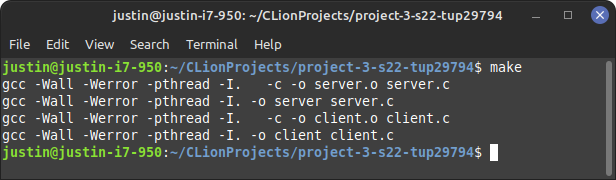
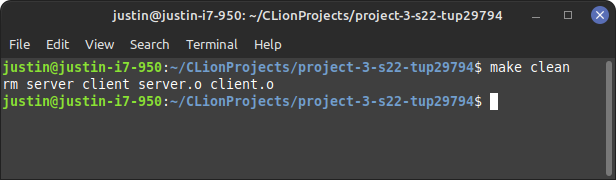

# Project-3-S22
- Justin M. Gallagher
- CIS 3207 Project 3 Multi-Threaded Echo Server
- Project 3 - Multi-threaded Echo Server
- Due Apr 13 by 1pm Points 10 Submitting a file upload Available after Mar 23 at 6am
# Project Overview

Echo servers are often used to demonstrate and test networked communication. In this assignment, you’ll create an echo server and echo client and evaluate their performance. The purpose of the assignment is to gain some exposure and practical experience with multi-threaded programming and the synchronization problems that go along with it, as well as with writing programs that communicate across networks.  

In this project you will develop a server program that echoes a text message on demand. Your echo server is to be a process that will read sequences of words (sentences) sent by clients. The sentences (text strings), sent by a client computer, will be sent back to the requesting client.  

# Installation (Using the make file)

>make

>make clean

#Usage
**Interactive Mode**

Server can be started with defaults, or by using any of the available flags!
- >prompt> ./server

or

- >prompt> ./server -a 127.0.0.1 -p 9999 -t exit

Client can be started with defaults, or by using any of the available flags!
- >prompt> ./client

or

- >prompt> ./client -a 127.0.0.1 -p 9999
